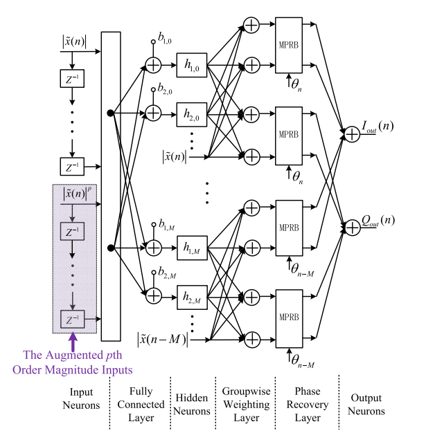
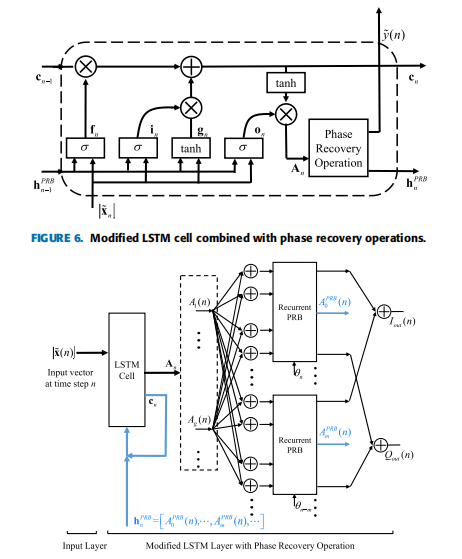
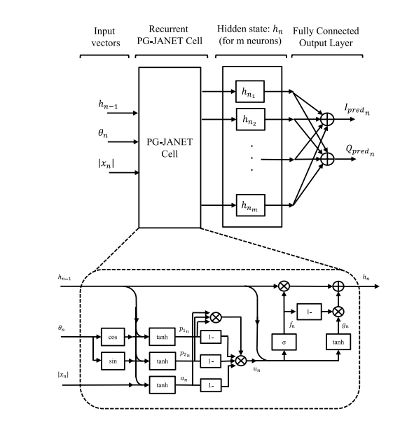
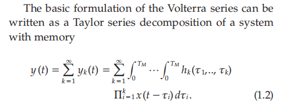
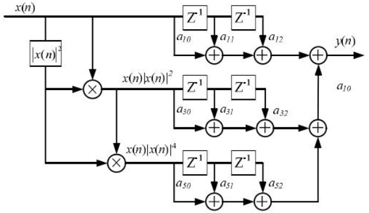

# 一些射频功率放大器DPD算法的论文复现，包括传统的级数模型和记忆多项式模型

## 该脚本实现了复杂高效神经网络行为模型到VerilogA行为模型之间的自动转换
## 优势
- 首次将可变仿真步长的离散递归神经网络，包括RNN,GRU,LSTM,BiLSTM以及注意力机制部署到了Verilog-A中，代码十分简洁高效
- 实现对代码超参数的灵活配置
###  AVDTDNN
Y. Zhang, Y. Li, F. Liu and A. Zhu, "Vector Decomposition Based Time-Delay Neural Network Behavioral Model for Digital Predistortion of RF Power Amplifiers," in IEEE Access, vol. 7, pp. 91559-91568, 2019, doi: 10.1109/ACCESS.2019.2927875.

### VDLSTM
H. Li, Y. Zhang, G. Li and F. Liu, "Vector Decomposed Long Short-Term Memory Model for Behavioral Modeling and Digital Predistortion for Wideband RF Power Amplifiers," in IEEE Access, vol. 8, pp. 63780-63789, 2020, doi: 10.1109/ACCESS.2020.2984682.

### JANET
T. Kobal, Y. Li, X. Wang and A. Zhu, "Digital Predistortion of RF Power Amplifiers With Phase-Gated Recurrent Neural Networks," in IEEE Transactions on Microwave Theory and Techniques, vol. 70, no. 6, pp. 3291-3299, June 2022, doi: 10.1109/TMTT.2022.3161024.

## 级数模型

## 记忆多项式模型

